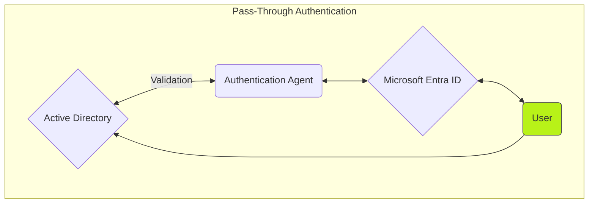

![[0000 AZ-500-Certification-Showcase.png]]

## Introduction

Once I obtained the [[0001 AZ-104 Certification Review|AZ-104 Certification]], I decided to continue learning more about Microsoft Azure but the security aspect of it. The [Azure Security Engineer](https://learn.microsoft.com/en-us/users/husenjan/credentials/63db89b5064d17ff) was the perfect certification for it as it goes through methodologies to secure our infrastructure in the cloud and our tenant inside Azure. In this post, I'll share my experience with studying and taking the exam for the certification.

## Preparation

First, I read through the [Microsoft Learn: Azure Security Engineer](https://learn.microsoft.com/en-us/credentials/certifications/exams/az-500/) course and while going through the course I took notes and deployed the different features in my own Azure environment. Here's a quick overview of the concepts and resources that were covered in the course materials.

- Microsoft Entra ID
- Microsoft Entra ID Licenses
- Microsoft Entra ID Groups
- Microsoft Entra ID Roles
- Azure RBAC Roles
- Microsoft Entra ID Protection
- Conditional Access
- Zero Trust
- Microsoft Entra PIM
- Microsoft Defender for Cloud/Endpoint/Servers/Storage/Key Vault
- Azure Enterprise Application
- Azure Blueprints
- Azure Bastion
- Azure Key Vault
- Azure SQL
- Azure Firewall
- Managed Identities
  - User-Assigned Identities
  - System-Assigned Identities
- Azure Event Hub
- Azure Logic App
- Azure Geography

After completing the course materials and the hands-on-labs, I decided to dig deeper into the different resources and features by creating diagrams to better understand the different concepts and the way they can be used together.

The diagrams significantly increased my understanding about the resources and features  as it forced me to reference different the different resources and features together. After creating tons of diagrams and linking multiple of resources and features together I decided to do multiple of choices which I found through Microsoft Learn, GitHub, and other places in the internet.

## Exam

When I'm studying for an certification I tend to over study therefore I decided to book the exam at 09:00 AM at 11/02/2024. The day I was going to take the exam I felt extremely nervous and once the exam started I became even more nervous as the exam had 57 questions, case study, and labs.

The multiple of choices, case study, and labs were extremely difficult and I spent a-lot of time answering these questions. I felt as the exam was meant to make me fail because I received a case study and labs in a single exam with 57 questions which is extremely rare according to multiple of people I spoke to. After delivering the exam the protocol software randomly crashed therefore I thought I failed the exam.

However, once I visited my Microsoft profile I saw that I received a badge for passing the [Azure Security Engineer](https://learn.microsoft.com/en-us/users/husenjan/credentials/63db89b5064d17ff) certification. I went from feeling bad to feeling extremely happy because I thought I completely screwed up the exam but I passed it!

