![[0000 AZ-305-Certification-Showcase.png]]

## Introduction

I obtained the [[0002 AZ-500 Certification Review|AZ-500 Certification]] for a month ago and after passing the certification, I decided to get the [Azure Solution Architect Expert (AZ-305)](https://learn.microsoft.com/en-us/credentials/certifications/exams/az-305/) certification since the information's in AZ-500 correlates with AZ-305. In this post, I'll share my experience with studying and taking the exam for certification.

## Preparation

As always I first read through the [Microsoft Learn: AZ-305](https://learn.microsoft.com/en-us/credentials/certifications/exams/az-305/) course. While going through the course I took notes and created graphs to further increase my understanding about Azure resources and features.  Here is an example of the graphs which I spent time making while taking notes:

**Azure Event Hub**

```mermaid
flowchart BT;
	subgraph subgraph1["Data"]
		1[Event Hub]
	end
	subgraph subgraph2["Data"]
		2(Streaming Data)
		3(Log, Files, Media)
		4(Weather Data)
		5(Business Data)
	end 
	subgraph subgraph3["Process"]
		6[Azure Functions]
		7[Batch Analytics]
		8[Azure Data Explorer]
	end
	subgraph2 --> subgraph1
	subgraph1 --> subgraph3
```

I also spent significant amount of time going through my notes and researching the different frameworks, resources and features as there were a-lot of things which I wasn't quite familiar with such as: 

* Microsoft Cloud Adoption Framework
- Azure Service Fabric
- Azure Cache for Redis
- Azure Application Insights
- Azure Data Lake
- Azure Data Factory
- Azure IT Service Management Connector
- Azure NetApp
- Azure Diagnostic Extension
- Azure HDInsights
- Azure SQL Analytics

Once I became familiar with these frameworks, resources, and features I spent decent amount of time going through my notes from [AZ-104](https://learn.microsoft.com/en-us/users/husenjan/credentials/63db89b5064d17ff), [AZ-500](https://learn.microsoft.com/en-us/users/husenjan/credentials/63db89b5064d17ff), and AZ-305 course materials.

## Exam

Today at 20:00, I was going through my notes and re-calling the things which I forgot. While taking a break I decided to check if there were any AZ-305 exams seats available on [PersonVUE](https://www.pearsonvue.com/) and I saw one that was available in 20:30 so I quickly purchased it and joined the AZ-305 exam.

My adrenaline was extremely high during the AZ-305 exam as I was taking the exam without fully preparing for it which is abnormal for me. The multiple of choice questions were medium difficulty and the case study was easy because it was related to the course material in [[0002 AZ-500 Certification Review|AZ-500]].

I completed the 59 questions in 45 minutes and accidentally ended up pressing the end button without realizing it. The screen took a bit time to load and once it successfully loaded I saw a passing score of 780! I was extremely relief and happy that I managed to obtain the [Certified Azure Solution Architect](https://learn.microsoft.com/en-us/users/husenjan/credentials/ae5226222b6183c4) certification.