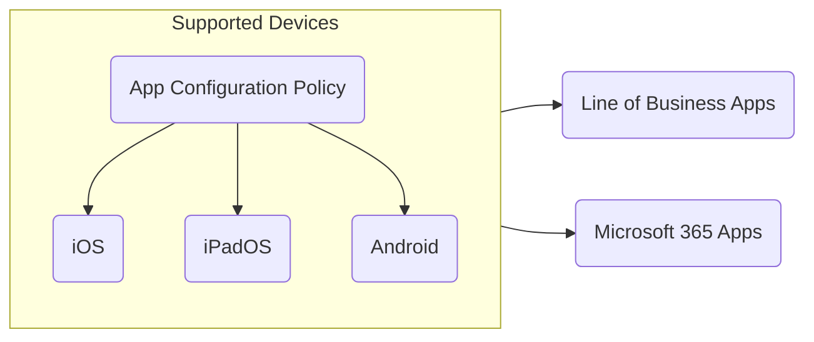

![[0000 MD-102-Certification-Showcase.png]]

## Introduction

I spent some time working with Microsoft Intune this year and became interested in learning more about it since it's widely used across different organizations. The [Microsoft Endpoint Administrator Associate (MD-102)](https://learn.microsoft.com/en-us/users/husenjan/credentials/1ddb60c27ac1f814) was the perfect certification to learn more about Microsoft Intune.  In this post, I'll share my experience with studying and taking the exam for the certification.

## Preparation

I mostly spent my time learning about Microsoft Intune on [Microsoft Learn: MD-102](https://learn.microsoft.com/en-us/credentials/certifications/modern-desktop/) as it contained a-lot of information's for correctly configuring and securing our endpoint devices and much more:

- Using the Enterprise Desktop Life Cycle as best practices for purchasing, managing, and retiring devices.
- Configuring configuration profiles.
- Configuring administrative templates, device restriction, and etc...
- Implementing Microsoft Defender using endpoint & detection policies.
- Securing devices and coperate using account protection policies and app protection policies.
- Increasing security of organziation using Windows Hello for Business.
- Improving effectiveness of Microsoft Intune using tools such as endpoint analytics.

I was unfamiliar with many of the concepts taught in the course and to improve my knowledge in Microsoft Intune, I decided to put the things I learnt into practice by troubleshooting Microsoft Intune issues which I was experiencing at work. 

Additionally, I singed up for Microsoft Intune Trial which allowed me to play around with Microsoft Intune in my own environment. After becoming more familiar with Microsoft Intune, I started creating diagrams to better memorize the different resources and features in it.

The diagrams so far has assisted me a-lot with understanding and memorizing complex concepts and I highly recommend everyone to make their own diagrams to challenge themselves on the different topics.

## Failed Exam Attempt

At 10 of May, I got home from work and started instantly studying for the [Microsoft Endpoint Administrator Associate](https://learn.microsoft.com/en-us/users/husenjan/credentials/1ddb60c27ac1f814) certification and after studying for a few hours I decided to book my exam and saw that one seat was available within 30 minutes. So, I quickly purchased the exam and took a break for 20 minutes and then joined the exam. 

The multiple of choices questions were extremely hard and the case study were easy. After completing all the questions and case study, I delivered in the exam and saw that I failed with 635 of 1000. I felt disappointed of myself since I have never failed a certification exam but this was a good experience as it pushed me to learn more about Microsoft Intune.

## Another Exam Attempt

At 17 of July, I was home and preparing for [Microsoft Endpoint Associate](https://learn.microsoft.com/en-us/users/husenjan/credentials/1ddb60c27ac1f814) certification and saw one seat was available within 1 hour. So, I quickly purchased the exam and took a hour break and then joined the exam. 

Everything was much different this time as multiple of choice questions were easy and the case study felt even easier. Once I completed selecting my answers for all the questions, I delivered in the exam and saw a passing score of 935 of 1000. I became so happy for passing the I became  [Certified Microsoft Endpoint Administrator Associate](https://learn.microsoft.com/en-us/users/husenjan/credentials/1ddb60c27ac1f814) certification since I spent a-lot of time learning about Microsoft Intune after failing the first exam attempt.