## Why Should I Use Cloud Services?

It can be difficult for organization's to justify the reasoning for moving to the cloud because of the cost associated to it. However, there are many benefits with moving to the cloud as it can help with reducing costs and increasing Recovery Time Objective (RTO) and Recovery Point Objective (RPO).

An example of reducing cost is when an organization purchases hardware the hardware is tax deducted over a period of years. However, when we are using a cloud provider such as Microsoft Azure the costs can be tax deductable within the same year since it's a operational costs. In addition, the hardware is main-tained and replaced by Microsoft which can help with reducing costs.

It's important to note that Microsoft Azure can help with reducing costs but it can also lead to increased costs if the architects and engineers doesn't follow the best practices.

## Infrastructure as Code 

Nowadays, most organization's uses Infrastructure as Code (IaaC) to create their cloud environment as that enables them to:

- Quickly create new cloud environment
- Quickly destroy the cloud environment
- Full overview of the cloud environment with version control

It's recommended to use Azure Biceps, Azure ARM Templates, or Terraform to create your cloud environ-ment. However, most organization's prefers Terraform as it's integrated with Azure, AWS, Digital Oceans, and multiple of other cloud providers.

## Azure Best Practices

Azure comes with many capabilities to organize our cloud resources since it can quickly become complex to manage our cloud resources. Here are some best practices to follow which are recommended by Microsoft:

- **Azure Resource Tag:** It's recommended to always take advantage of Azure Resource Tag as it can help with finding who's owner of the cloud resource and which department is responsible for it.
- **Azure Resource Lock:** It's highly recommended to use Resource Lock as it prevents cloud resources from accidentally being deleted by a contributor
- **Azure Policy:** You must take advantage of Azure Policy as it enables us to enforce users to use specific tags before they are allowed to create the resource

If Azure Resource Tag and Azure Resource Lock is not adapted in the early stages it can quickly become complex to manage the cloud environment and that can lead to increased costs.

## Azure Migration

If your organization is migrating from on-premises to Microsoft Azure it's recommended to take a closer look at the following tools developed by Microsoft:

- **Azure Migrate:** Assists us with migrating on-premises virtual machines to Microsoft Azure
- **Azure Data Box:** Assists us with uploading on-premises data to Microsoft Azure

Azure Migrate can be connected with vSphere to scan for on-premises virtual machines and also provide us a cost estimation for the migration. Azure Data Box is a box organization's can order to upload their data to Azure instead of transferring terabytes of data through the internet.

## Azure Virtual Network

Azure Virtual Network is our networking environment in the cloud and it enables us to do the following:

- Peer multiple of virtual networks together
- Choose a subnet mask
- Choose a address space

We can also attach **Azure Network Security Group** to the virtual network, subnet mask, and virtual machines and that allows us to do the following:

- Allow/Block communication on specific port
- Allow/Block communication from a specific IP-address

It's only recommended to use Azure Network Security Group on virtual network and subnet mask level because if an issue occurs troubleshooting it will be much easier. It's recommended by Microsoft to use a **Hub & Spoke Virtual Network** setup to secure our cloud resources:

- **Hub Virtual Network:** Contains Azure Firewall, Azure Bastion, and VPN Gateway
- **Spoke Virtual Network:** Contains Virtual Machines and other cloud resources which requires a virtual network

We should always take advantage of Hub & Spoke Virtual Network as it will ensure all traffic that goes in and out the network is secure and non malicious.

## Azure Firewall

Azure Firewall comes with many capabilities to protect our cloud resources from malicious threat actors. It also allows us to configure the firewall to accept or decline specific traffic and ports. Azure Firewall also comes with three different SKUs:

- **Default SKU:** Supports only 2 virtual machines and provides alert on malicious threat actors pattern
- **Standard SKU:** Provides protection against malicious threat actors from known malicious IP-addresses and domains
- **Premium SKU:** Provides capabilities such as signature based IDPS and rapid detection by looking at specific pattern

We should only use Premium SKUs depending on the risk tolerance of the organization as some are willing to risk more to reduce costs and others are willing to spend more to reduce risk. As architects and engin-eers our responsibility is to comply with the risks the management has accepted. 

## Azure Web Application Firewall

Azure Web Application Firewall (WAF) provides a centralized protection for web application from common exploits and vulnerabilities. It can help with protecting our website from server-side template injection, cross-stie scripting, path traversal, and SQL injection attacks and much more.

> [!Note]
> Azure Web Application Firewall can also protect cloud resources such as  Azure Application Gateway and Azure Front Door.

## Azure Application Gateway & Azure Load Balancer

Azure Application Gateway is recommended for balancing HTTP traffic between multiple of virtual machines as it comes with advanced routing and more security capabilities. However, Azure Load Balancer is recommended for distributing TCP and UDP traffic between multiple of virtual machines.

## Azure Virtual Machine

Azure Virtual Machines are as any virtual machines that we could create in an VMWare vSphere, it also comes with capabilities to deploy custom ISO files in-case we need to move our legacy virtual machines to Microsoft Azure.

Azure also enables us to take advantage of **Azure Availability Zones** incases of disaster since each Azure Availability Zone has distinct power source, network, and cooling. Another Azure feature which we can also take advantage of **Azure Virtual Machine Scale Set** to deploy more virtual machines when the demand is high and automatically decrease it when the demand is low.

We can also use **Azure Availability Sets** to increase the up-time for our virtual machines. Here is a overview of Azure Availability Sets:

- **Update Domain:** A group of virtual machines which are rebooted at the same time when doing an update
- **Fault Domain:** A group of update domains where the traffic is forwarded when one fault domain is under maintenance

When **Fault Domain 1** goes down because of a disaster than the traffic is forwarded to **Fault Domain 2**. It's important to note that it's possible to have more than two fault domains.

> [!Important]
> We can also reduce the costs of the Azure Virtual Machines by taking advantage of Azure Hybrid Benefits and Azure Reservation.

## Azure Bastion

```mermaid
	flowchart LR
	User(User)
	Portal(Azure Portal)
	Bastion(Azure Bastion)
	VM(Virtual Machine)
	User -- "TLS" --> Portal 
	Portal -- "Internet (Port 443)" --> Bastion

    subgraph ide2 [Hub Virutal Network]
		Bastion
	end
	
	subgraph ide1 [Spoke Virtual Network]
		Bastion -- "RDP (Port 3389)" --> VM
    end
	style User fill:#b8f218,stroke:#333,stroke-width:1px
```

Azure Bastion is a great solution for connecting to virtual machines without going through the public internet. It allows us to access all the virtual machines inside our virtual network and virtual networks which are peered together.

## Azure Site Recovery

Azure Site Recovery replicates all our Azure Resources from one region to another in-case a disaster occurs with our primary region.   According to Microsoft; Azure Site Recovery has a RTO SLA for one hour to replicate our environment to a different region.

## Azure Front Door

Azure Front Door is a Content Delivery Network that delivers our static web application faster and more reliably. It will automatically forward the user to the closest server. If an region fails than the traffic is automatically forwarded to the closest available server. 

## Azure Batch

Azure Batch is commonly used for HPC purposes as it allows us to manage nodes, install application to nodes, and schedule jobs on the nodes. A node is a virtual machine that Azure Batch manages.

## Azure Container

Azure Container is a small and lightweight operating system which is commonly used for developing applications. It enables us to quickly share our code with clients and other developers without troubleshooting the host operating system. 

Azure Containers are fantastic for running simple applications which doesn't require complex networking front-end or back-end.

## Azure Kubernetes 

Azure Kubernetes comes with the same capabilities as Kubernetes since it allows us to do the following:

- Starting new containers when necessary
- Restarting containers when they crash
- Spreading out the work to different containers
- Scaling up and down depending on demand

It also enables us to create complex networking environment with front-end network, back-end network, and internal network. 

## Azure Storage

Azure Storage comes with many different capabilities and options to store our data's.

- **Azure Blobs:** Recommended for storing texts, videos, and audio files
- **Azure Files:** Recommended for creating a File-Share where users can upload/download from
- **Azure Queues:** Recommended for storing large amount of text messages
- **Azure Tables:** Recommended for applications that are using NoSQL

Azure also provides us the option to store our files in different tiers.

- **Hot Tier:** Recommended for data which is accessed frequently
- **Cool Tier:** Recommended for data that will stay for longer than 30 days
- **Cold Tier:** Recommended for data that will stay for longer than 90 days
- **Archive Tier:** Recommended for data that will stay for loner than 180 days

Microsoft has implemented the following tools to enable us to work with the different storage options.

- **AzCopy:** A CLI Tool which allows us to download, upload and manage Azure Storages
- **Azure Storage Explorer:** A GUI Tool which can be used for uploading, downloading, and managing Azure Storage options
- **Azure File Sync:** Synchronizes our on-premises environment with Azure Files

It's good to have a fundamental understanding about Azure Storage as it can help with implementing the correct solution and reduce costs.

## Azure Blobs

Azure Blobs is recommended for storing texts, images, videos, and audio files. With Azure Blobs it's also possible to create snapshots for each object and quickly obtain the old version of the object. It also comes with the capabilities to store objects in the following tiers:

- **Hot:** Recommended to use if the data is frequently accessed
- **Cool:** Recommended to use if the data is going to be stored for 30 days
- **Archive:** Recommended to use if the data is going to be stored for longer than 180 days

Azure Blobs also allows us to store confidential files and legal files which are not supposed to be modified or deleted using the following features:

- **Time-Based Retention Policies:** Objects can be created and read but not modified or deleted to the retention period has expired on the object.
- **Legal Hold Policies:** Objects can be created and read but not modified or deleted to legal hold is cleared

Understanding the different capabilities of Azure Blobs is extremely useful while integrating to cloud as it can help with reducing costs, confidentiality, and authenticity.

## Azure Functions

Azure Functions is a serverless feature that allows us to execute code without worrying about the virtual machine. It's recommended to use Azure Functions to run code which handles REST Requests, Timer, and Messages.

> [!Note]
> With Azure Functions we are only charged for per-second resource consumptions and execution.

## Azure Logic Apps

Azure Logic Apps is a serverless compute solution that enables us to create automated workflow without having understanding about programming or scripting. We can create a automated workflow which sends a email to specific users or groups when a event is triggered.

## Azure App Service

Azure App Service is a Platform as a Service (PaaS) solution that provides us with the capability to run our application code or docker container without needing to maintain the operating system. You can choose three different ways to deploy the application code and container: 

- **Shared:** Runs application on the same virtual machine including other customers apps
- **Dedicated:** Runs application on dedicated virtual machine and apps on the same App Service Plan share the same compute resources
- **Isolated:** Runs the application on a dedicated virtual machine on a dedicated virtual network

Azure App Service is a Platform as a Service (PaaS) solution that provides us with the ability to run application code.

## Azure SQL

Azure SQL is a PaaS solution that is fully managed service where you don't have to deal with configuring, managing, tuning, and backups. You can also choose between the following two pricing models: 

- **DTU:** Fixed price for covering compute, data storage, and backup retention
- **vCore:** Seperate charges for compute, data storage, and backup retention

It's also possible to scale Azure SQL depending on the demand to reduce the costs. Azure SQL also comes with the following data security features:

- **Data At Rest:** Transparent Data Encryption
- **Data In Motion:** Secure Socket Layers & Transport Layer Security
- **Data In Process:** Dynamic Data Masking

These features helps with securing our data at different situations to ensure it stays confidential and secure at all times. 

>[!Important] 
>If you're migrating SQL database from on-premises it's recommended to use **Azure SQL Managed Instance** as it's better for lift-and-shift scenarios and it comes than Azure SQL.

## Azure Data Warehouse

Azure Data Warehouse is used for storing large amount of structured data which will be used for creating Data Visualization, Power BI, and Data Analytics. Azure Data Warehouse is more expensive to operate and maintain therefore it's recommended to use Azure Data Lake.

## Azure Data Lake

Azure Data Lake is used for storing large amount of structured, semi-structured, and unstructured data. With all the data inside the Azure Data Lake we can use tools such as **Azure Databricks** and **Power BI** to create analytical prediction and graphs for management and board members.

## Microsoft Entra Application Proxy

Microsoft Entra Application Proxy is a resource that enables us to access our on-premises applications through an extneral URL. It also allows us to use SSO and MFA on our application to increase security.

## Azure Key Vault

Azure Key Vault is commonly used for storing certificates and secrets. Azure Key Vault also comes with different SKUs:

- **Default:** Supports Secrets and Certificates
- **Premium:** Supports Secrets, Certificates, and HSM Protected Keys

Our applications can access these keys using the following authentication methods:

- **Managed Identities:** You can assign a identity to Azure Resource so it can access the Azure Key Vault
- **Service Principal and Certificate:** You can use service principal and an associated certificate to access the Azure Key Vault
- **Service Principal and Secrets:** You can also use service principal and associated secret to access the Azure Key Vault 

It's recommended to use Managed Identities if you want a specific resource to access the Azure Key Vault as it's the most secure option. Note that Azure Key Vault is automatically backed up to a secondary region in-case of a disaster.

## Articles To Read

Microsoft highly recommends reading the following articles if the organization is considering moving to Microsoft Azure:

- [Accelerate migration](https://learn.microsoft.com/en-us/azure/cloud-adoption-framework/get-started/migrate)
- [Manage cloud costs](https://learn.microsoft.com/en-us/azure/cloud-adoption-framework/get-started/manage-costs)
- [Build a cloud operations team](https://learn.microsoft.com/en-us/azure/cloud-adoption-framework/get-started/team/cloud-operations)
- [Assessments](https://learn.microsoft.com/en-us/assessments/)

It's important to read through the articles as it will ensure that the organization's cloud environment follows the SLA, RPO, RTO set by the management. The articles will also go through the different challenges that will come with moving to the cloud such as training employees and following strict RBAC procedures.

## Conclusion

Microsoft Azure offers many ways to implement our cloud environment and it comes with many security capabilities to keep our environment secure. It also comes with many capabilities to increase the RTO and RPO to achieve the goals set by the management. Microsoft Azure also supports all sizes of organization's ranging from small, medium, and large to help them with integrating to the cloud.