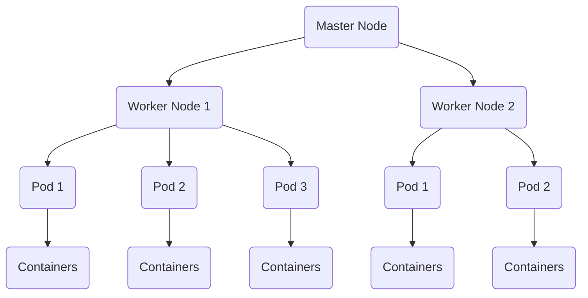

## Introduction

I recently saw that a-lot of job postings are requesting IT-Professionals with Kubernetes skills and I haven't really worked with Kubernetes at all. Therefore I decided to research Kubernetes to understand the way it works and create my own Kubernetes cluster.

## What is Kubernetes?

Kubernetes is used to manage and scale applications running in containers. A container is a small and isolated environment which is commonly used by developers to develop applications because it allows them to share the container with other developers and clients without any issues occurring because of configuration on laptop/server.

Kubernetes extends the functionality of container by allowing us to do the following actions:

- Starting new apps when needed
- Restarting apps if they crash
- Spreading out work through different systems
- Scaling up and down depending on the demands

These are some of the benefits of Kubernetes, and we can extend the functionality by using extensions. Here are some terms which are useful to be aware of while working with Kubernetes:

- A Kubernetes Environment is considered to be a Cluster.
- A Cluster contains nodes which are our virtual machines/physical machines that will be running our containers.
- A Node Master controls all the Worker Nodes and tells them to run containers.

These terms will be used throughout the document so it's important to be familiar with them.

## Setting Up Kubernetes Cluster



I'll be using Ubuntu 24.04.1 LTS Server for setting up the Kubernetes environment. The Kubernetes Cluster will have a single master node and two worker nodes. Now let's get started with setting up our Kubernetes Cluster!

First we need to create an overview of our Networking environment for Ubuntu Servers since this will help us with understanding our environment.

| Server Name                                | IP Address     | Host Name  |
| ------------------------------------------ | -------------- | ---------- |
| Ubuntu Server 1 - Master Node              | 192.168.58.200 | `kmaster`  |
| Ubuntu Server 2 - Kubernetes Worker Node 1 | 192.168.58.201 | `kworker1` |
| Ubuntu Server 3 - Kubernetes Worker Node 2 | 192.168.58.202 | `kworker2` |

We need to SSH into all of the servers and create a `01-netcfg.yaml` inside `/etc/netplan` folder with the following content inside them:

**Ubuntu Server 1**

```yaml
network:
  ethernets:
    ens33:
      dhcp4: false
      addresses: [192.168.58.200/24]
      routes:
        - to: default
          via: 192.168.58.2
      nameservers:
        addresses: [8.8.8.8, 8.8.4.4]
```

**Ubuntu Server 2**

```yaml
network:
  ethernets:
    ens33:
      dhcp4: false
      addresses: [192.168.58.201/24]
      routes:
        - to: default
          via: 192.168.58.2
      nameservers:
        addresses: [8.8.8.8, 8.8.4.4]
```

**Ubuntu Server 3**

```yaml
network:
  ethernets:
    ens33:
      dhcp4: false
      addresses: [192.168.58.202/24]
      routes:
        - to: default
          via: 192.168.58.2
      nameservers:
        addresses: [8.8.8.8, 8.8.4.4]
```

You will need to change the `addresses` and `routes` field to your own networking environment as the IP-address and subnet mask will be different. I also recommend disabling DHCP on `50-cloud-init.yaml` file on all the Ubuntu Servers to ensure our servers only has the static IP-address assigned to it.

```yaml
network:
    ethernets:
        ens33:
            dhcp4: false
    version: 2
```

Once that is completed, we will need to use the following commands to apply the networking configuration to Ubuntu Servers:

```
chmod -R 600 /etc/netplan/01-netcfg.yaml
sudo netplan apply --debug
```

Now if you're SSH into the server you will be disconnected and you will need to re-connect using the new IP-address. Now inside our `/etc/hosts` file we can add all our IP-addresses with hostnames:

```
192.168.58.200 kmaster
192.168.58.201 kworker1
192.168.58.202 kworker2
```

Now we will need to login as `root` and install all the necessary resources for our Kubernetes Cluster:

```bash
# Logging in as root
sudo su root

# Getting Latest Repository
sudo apt-get update

# Installs CURL
sudo apt-get install apt-transport-https ca-certificates curl gpg -y

 # Downloading Public Signing Key for Kubernetes Packages
curl -fsSL https://pkgs.k8s.io/core:/stable:/v1.31/deb/Release.key | sudo gpg --dearmor -o /etc/apt/keyrings/kubernetes-apt-keyring.gpg

# Setting up Repository
echo 'deb [signed-by=/etc/apt/keyrings/kubernetes-apt-keyring.gpg] https://pkgs.k8s.io/core:/stable:/v1.31/deb/ /' | sudo tee /etc/apt/sources.list.d/kubernetes.list

# Getting Latest Repository for Kubernetes
sudo apt-get update

# Installs Docker
sudo apt-get install docker.io -y

# Installs Kubernetes
sudo apt-get install kubeadm kubelet kubectl kubernetes-cni -y
```

On the Ubuntu Server which will be our `kmaster` execute the following command:

```bash
sudo kubeadm init
```

Once it's executed successfully you should receive a command such as this:

```bash
kubeadm join 192.168.58.200:6443 --token selqlq.at3ujabpdpnafhwg --discovery-token-ca-cert-hash sha256:b9e195f167d96f52c8540e3145903b9822ef3acb393263d3a05f8cac7efb74a2
```

You will need to execute that command on the worker nodes such as `kworker1` and `kworker2` and once that is completed execute the following command on `kmaster`:

```bash
sudo mkdir -p $HOME/.kube
sudo cp -i /etc/kubernetes/admin.conf $HOME/.kube/config
sudo chown $(id -u):$(id -g) $HOME/.kube/config
export KUBECONFIG=/etc/kubernetes/admin.conf
```

Now to see all the nodes on our Kubernetes Cluster use the following command:

```
root@kmaster:/home/gnosis# kubectl get nodes
NAME       STATUS     ROLES           AGE     VERSION
kmaster    Ready      control-plane   7m44s   v1.31.1
kworker1   NotReady   <none>          3m47s   v1.31.1
kworker2   NotReady   <none>          3m20s   v1.31.1
```

All our worker nodes are in `NotReady` status and to resolve this we need to setup Calico on our Kubernetes Cluster since it provides networking functionality and enforces network policies on our cluster:

```bash
kubectl apply -f https://raw.githubusercontent.com/projectcalico/calico/refs/heads/master/manifests/calico.yaml
```

Now all our nodes should be in the `Ready` status to see all the nodes use the same command again:

```
root@kmaster:/home/gnosis# kubectl get nodes
NAME       STATUS   ROLES           AGE   VERSION
kmaster    Ready    control-plane   24m   v1.31.1
kworker1   Ready    <none>          20m   v1.31.1
kworker2   Ready    <none>          19m   v1.31.1
```

To ensure our Kubernetes Cluster is working properly, we can deploy container with multiple of pods with a load balancer using the following commands:

```bash
kubectl apply -f https://k8s.io/examples/service/load-balancer-example.yaml
kubectl expose deployment hello-world --type=LoadBalancer --name=my-service
```

```
root@kmaster:/home/gnosis# kubectl get pods
NAME                           READY   STATUS    RESTARTS   AGE
hello-world-6ddfc454c8-28x4k   1/1     Running   0          9s
hello-world-6ddfc454c8-cnks2   1/1     Running   0          9s
hello-world-6ddfc454c8-dbv7q   1/1     Running   0          9s
hello-world-6ddfc454c8-fl5sv   1/1     Running   0          9s
hello-world-6ddfc454c8-qbb8r   1/1     Running   0          9s
```

To see which port the load balancer is running at use the following commands:

```bash
kubectl get svc
```

You should now be able to `curl` the web application and visit it through a web browser:

```
root@kmaster:/home/gnosis# curl http://192.168.58.201:32506
Hello, world!
Version: 2.0.0
Hostname: hello-world-6ddfc454c8-dbv7q
root@kmaster:/home/gnosis# curl http://192.168.58.202:32506
Hello, world!
Version: 2.0.0
Hostname: hello-world-6ddfc454c8-fl5sv
```

## Conclusion

I learnt a lot about Kubernetes while setting up my own cluster. However, there are still a lot of things to learn about Kubernetes such as creating custom networking environment, custom networking policies, and use Terraform to manage our kubernetes environment. Once I'm more familiar with these concepts I'll try to include them into the document.